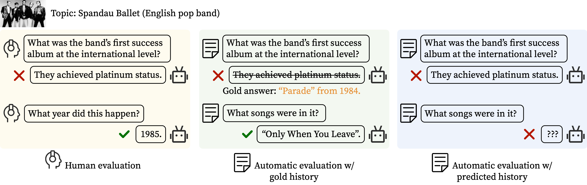
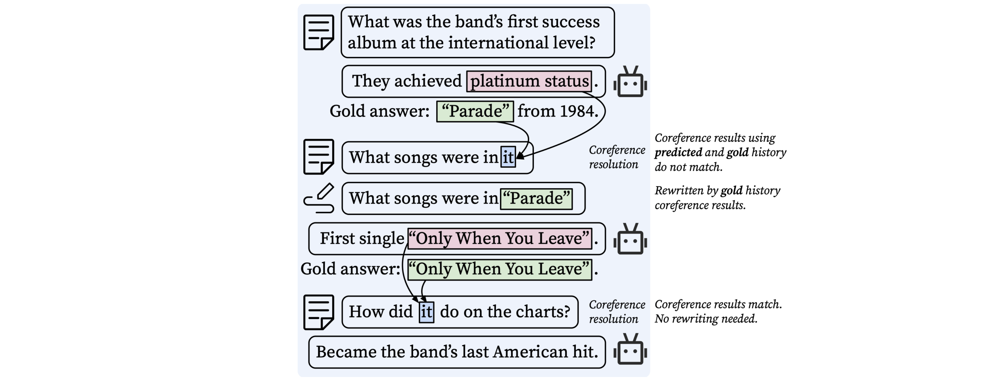

# Ditch the Gold Standard: Re-evaluating Conversational Question Answering
This is the repository for our paper [Ditch the Gold Standard: Re-evaluating Conversational Question Answering](https://arxiv.org/pdf/2112.08812.pdf). 

## Overview

In this work, we conduct the first large-scale human evaluation of state-of-the-art conversational QA systems. In our evaluation, human annotators chat with conversational QA models about passages from the [QuAC](https://quac.ai) development set, and after that the annotators judge the correctness of model answers. We release the human annotated dataset in the following section. 

We also identify a critical issue with the current automatic evaluation, which pre-collectes human-human conversations and uses ground-truth answers as conversational history (differences between different evaluations are shown in the following figure). By comparison, we find that the automatic evaluation does not always agree with the human evaluation. We propose a new evaluation protocol that is based on predicted history and question rewriting. Our experiments show that the new protocol better reflects real-world performance compared to the original automatic evaluation. We also provide the new evaluation protocol code in the following.



## Human Evaluation Dataset
You can download the human annotation dataset from `data/human_annotation_data.json`. The json file contains one data field `data`, which is a list of conversations. Each conversation contains the following fields: 

* `model_name`: The model evaluated. One of `bert4quac`, `graphflow`, `ham`, `excord`.
* `context`: The passage used in this conversation.
* `dialog_id`: The ID from the original QuAC dataset.
* `qas`: The conversation, which contains a list of QA pairs. Each QA pair has the following fields:
  * `turn_id`: The number of turn. 
  * `question`: The question from the human annotator.
  * `answer`: The answer from the model.
  * `valid`: Whether the question is valid (annotated by our human annotator).
  * `answerable`: Whether the question is answerable (annotated by our human annotator).
  * `correct`: Whether the model's answer is correct (annotated by our human annotator).

## Automatic model evaluation interface

We provide a convenient interface to test model performance on a few evaluation protocols compared in our paper, including `Auto-Pred`, `Auto-Replace` and our proposed evaluation protocol, `Auto-Rewrite`, which better demonstrates models' performance in human-model conversations. Please refer to our paper for more details. Following is a figure describing how Auto-Rewrite works.



To use our evaluation interface on your own model, follow the steps:

* Step 1: Download the [QuAC dataset](https://quac.ai).

* Step 2: Install `allennlp`, `allennlp_models`, `ncr.replace_corefs` through `pip` if you would like to use `Auto-Rewrite`.

* Step 3: Download the [CANARD dataset](https://sites.google.com/view/qanta/projects/canard) if you would like to use `Auto-Replace`.

* Step 4: Write a model interface following the template `interface.py`. Explanations to each function are provided through in-line comments. Make sure to import all your model dependencies at the top.

* Step 5: Add the model to the evaluation script `run_quac_eval.py`. Changes that are need to be made are marked with `#TODO`.

* Step 6: Run evaluation script. See `run.sh` for reference. Explanations of all arguments are provided in `run_quac_eval.py`. Make sure to turn on only one of `--pred`, `--rewrite` or `--replace`.

## Citation

```
@article{li2021ditch,
   title={Ditch the Gold Standard: Re-evaluating Conversational Question Answering},
   author={Li, Huihan and Gao, Tianyu and Goenka, Manan and Chen, Danqi},
   journal={arXiv preprint arXiv:2112.08812},
   year={2021}
}
```
